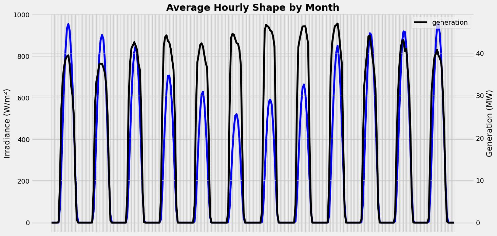
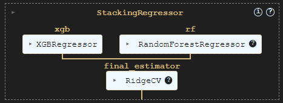
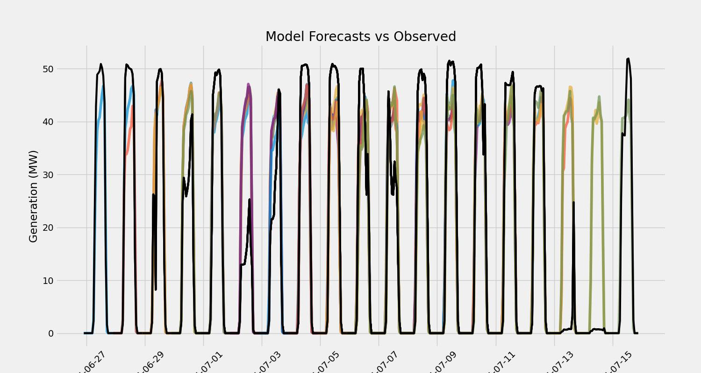

# Solar Generation Forecast for UFV Bom Jesus da Lapa

This project aims to deliver a forecast for solar power generation using metereological data in a regression problem solved by a Machine Learning model.

## Instalation

You can check the data by running the code below

```bash
git clone https://github.com/joancsz/solar_generation_forecast.git
```
## Enviroment

You can install the environment by running the code below
```bash
pip install -r requirements.txt
```
## Warning 🚨
You might need to fix deprecated code when using the library Skoptimize

# The model

In this project the objective was to forecast the solar power generation by using metereological data as features in the model, based on that it was collected forecasted data from the european model ECMWF HRES with 9km resolution to build features
In the image below, the average hourly shape by month is displayed for both observed generation and predicted irradiance from ECMWF.



A model was built stacking two weak learners (XGBRegressor and RandomForestRegressor) as represented in the fluxogram below.



Finally, the model was able to represent the daily hourly shape when applied to various forecast of the ECMWF model (10 days horizon each)



Evaluating the model using Mean Absolute Error (MAE) in hourly series an average of 4.6 MW was observed, and when compared on weekly series this error decreases to 2 MW on average.
